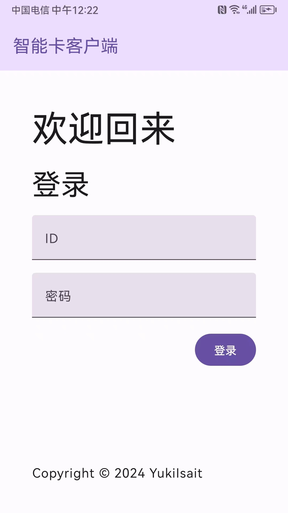

# Identity Authentication Access Control System Based on NFC Technology - Card Swiping and Maintenance Program

🌍 *[简体中文](README.md) ∙ [English](README-EN.md)*

An identity authentication access control system based on NFC technology. Leveraging the portability and intelligence of mobile terminal devices, the system achieves rapid and secure identity verification through NFC technology. This repository is part of the implementation of the mobile card swiping and maintenance program.

## Main Technologies

- Kotlin
- Jetpack Compose
- Lifecycle ViewModel
- Retrofit

## Running the Project

> Note: This repository is for the front-end part of the project, which needs to be used in conjunction with the back-end.

This project uses `Android Studio` as the development tool. You can directly import the project and run it on an emulator or real device.

## Project Previews

1. Login Page

    

2. Card Swiping Page

    

3. Communication Completed Page

    

4. Device Maintenance Page

    

## License

This project is licensed under the MIT License. See the [LICENSE](LICENSE.md) file for details.
