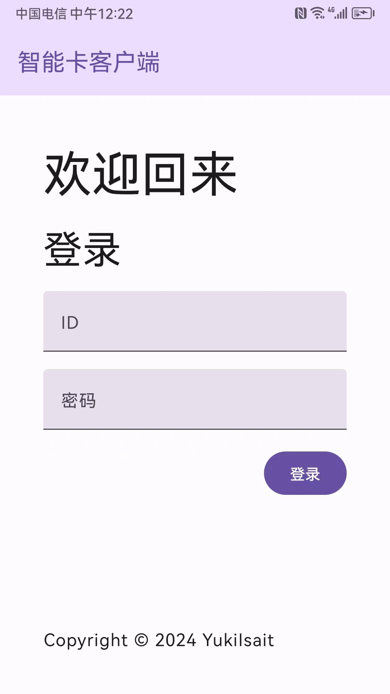
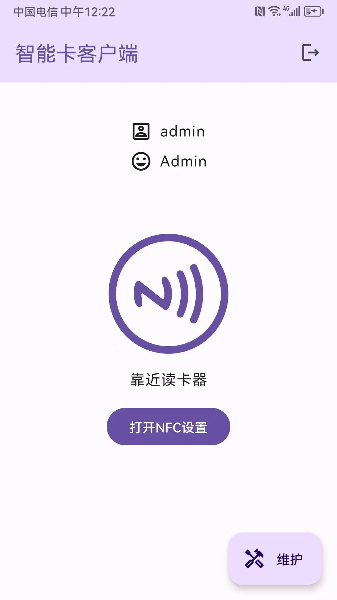
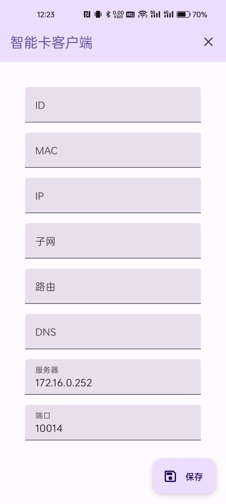

# 基于NFC技术的身份验证门禁系统 - 刷卡和维护程序

🌍 *[English](README-EN.md) ∙ [简体中文](README.md)*

一种基于NFC技术的身份验证门禁系统，利用移动终端设备的便携性和智能化特点，通过NFC技术实现快速、安全的身份验证，并通过物联网技术管理身份信息，提高安全性和灵活性。本仓库为移动端刷卡和维护程序的实现部分。

## 主要技术

- Kotlin
- Jetpack Compose
- Lifecycle ViewModel
- Retrofit

## 运行项目

> 注意：本仓库为项目的前端部分，需要配合服务端使用。

本项目使用`Android Studio`作为开发工具，可以直接导入项目，然后通过模拟器或真机运行。

## 项目预览

1. 登录页面

    

2. 刷卡页面

    

3. 通信完成页面

    

4. 设备维护页面

    

## 开源许可

本项目开源于MIT许可证，详见[LICENSE](LICENSE.md)文件。
